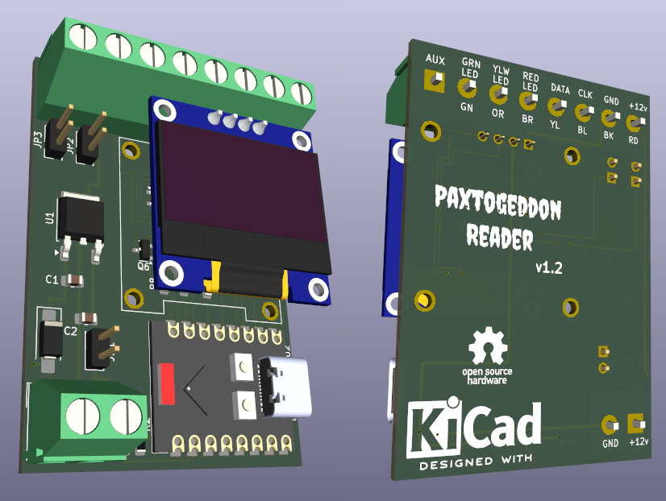
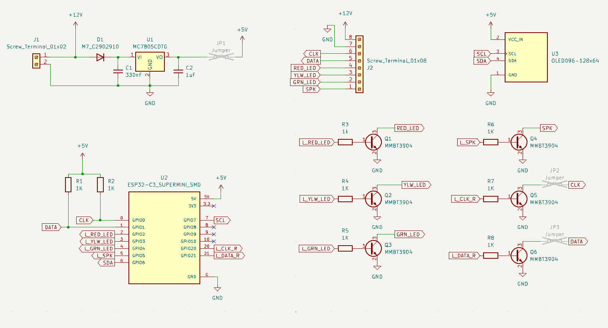
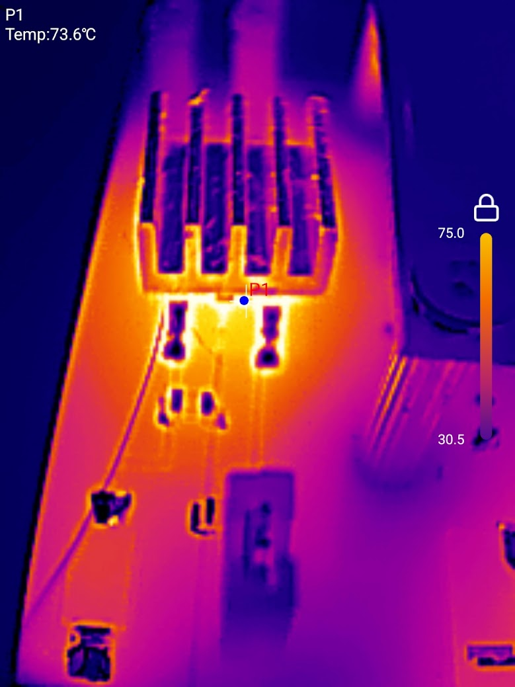
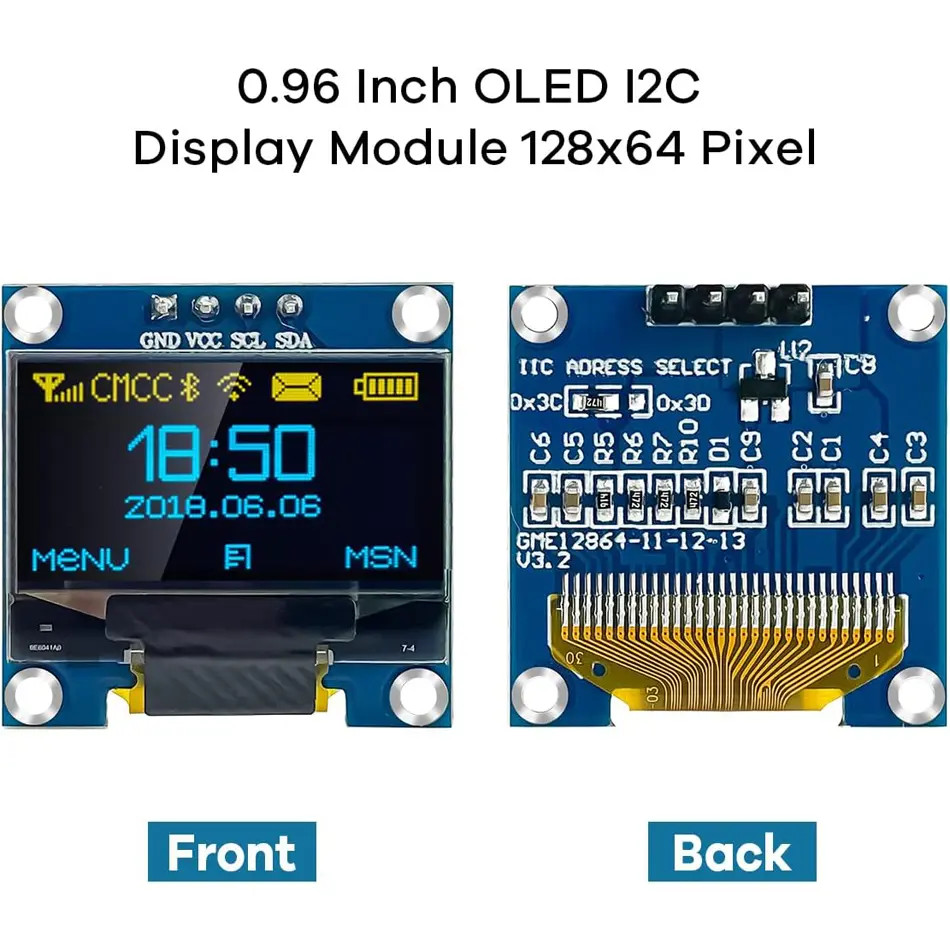

# Paxtogeddon-OLED-PCB
### Hardware files for the Paxtogeddon reader with OLED display

#### kicad

The kicad directory contains the kicad project files to make a PCB for the Paxtogeddon reader. This was a project to learn Kicad and PCB design so set your expectations accordingly! If you just want to make one Paxtogeddon reader to use then you might find using 00Waz's [protoboard design](https://github.com/00Waz/Paxtogeddon-Reader) quicker and easier than ordering pcb's and smt parts from China.

#### gerbers

The gerbers directory contains the gerbers for the v1.2 board and a zip file paxtogeddon-gerbers_v1_2.zip which is the zip file uploaded to JLC for manufacture of the PCB's. 

#### case

The case directory contains the STL files for the 3D printed case to suit an Anker 525 power bank.

### Firmware

This uses mostly the same code written by Daniel as the [board by 00Waz](https://github.com/00Waz/Paxtogeddon-Reader) with some additions to write to an OLED display. However the pin assignments are different and the pins to playback a card on this pcb switch transistors so the logic is inverted. The V1 directory contains the first attempt at adding an OLED, the additions were done by en4rab so any mistakes and poor code are my fault and not Daniels!  
While V1 works it is messy Daniel is currently working on a v2.0 firmware which should be done in a few weeks. When it is ready a link to it will be added. The pcb files have been put up a little early so the early code is here as a placeholder. 

### Schematic

### Building the PCB
#### Assembly

Assembly is fairly straightforward. When soldering the 4 pin female header for the OLED it is easier to align it if you attach the brass standoffs to an OLED, put the header on the OLED pins then use it as a jig to hold the header in position while you solder it.

The jumper JP1 was for development to allow the 5v to be separated from the ESP32 so the Paxton reader could be powered by 12v while the esp was powered by usb for debugging. In normal use it should be connected.

JP2 and JP3 were to disconnect the card playback pins if that was not needed. In the latest firmware are unused and should be left disconnected.

Once the PCB has been soldered and cleaned use the Halnziye HY910 thermal glue to stick a small aluminium heatsink to the 7805 regulator. Initial tests without a heatsink had the regulator at about 89C adding a small heatsink lowered this to about 75C its a bit of a bodge but it seems to be working ok.

#### Parts used 

This is a list of the parts used. They are not necessarily the best source and if you are being organised you could probably source everything in one order from Mouser/RS/Farnell but the links given are what was used. the 8 way screw terminal was 2x4 way terminals as they were easier to source.

| Reference                     | Value                                                        | Footprint | Link                                                  | Price           |
| ----------------------------- | ------------------------------------------------------------ | --------- | ----------------------------------------------------- | --------------- |
| C1                            | 330nF 50v                                                    | 0805      | https://www.aliexpress.com/item/1005008635911110.html | £12.59 per 2000 |
| C2                            | 1uF 16v                                                      | 0805      | https://www.aliexpress.com/item/33052613891.html      | £0.88 per 100   |
| D1                            | M7 (1N4007)                                                  | A-SMA     | https://www.ebay.co.uk/itm/374441259098               | £4.66 per 100   |
| J1                            | Screw_Terminal_01x02                                         |           | https://www.aliexpress.com/item/1005003556955422.html | £4 per 50       |
| J2                            | 2x Screw_Terminal_01x04                                      |           | https://www.aliexpress.com/item/1005003556955422.html | £7.55 per 50    |
| JP1,JP2,JP3                   | Jumper                                                       |           | https://www.aliexpress.com/item/32853010777.html      | £0.41 per 50    |
| Q1,Q2,Q3, Q4,Q5,Q6       | MMBT3904                                                     | SOT-23    | https://www.aliexpress.com/item/1005006991695298.html | £6.69 per 3000  |
| R1,R2,R3,R4, R5,R6,R7,R8 | 1K 1/4W                                                      | 0805      | https://www.aliexpress.com/item/1005006786740896.html | £5.80 per 5000  |
| U1                            | MC7805CDTG                                                   | TO-252-3  | https://www.aliexpress.com/item/1005007322548974.html | £1.16 per 5     |
| U2                            | ESP32-C3 Supermini                                           |           | https://www.aliexpress.com/item/1005006056663228.html | £1.89           |
| U3                            | OLED096-128x64                                               |           | https://www.aliexpress.com/item/1005006700885056.html | £1.74           |
|                               | 4 pin socket female                                          |           | https://www.ebay.co.uk/itm/192175350096               | £3.89 per 100   |
|                               | Heatsink                                                     | 9x9x5mm   | https://www.aliexpress.com/item/1005004453446730.html | £4.59 per 50    |
|                               | Halnziye HY910 Thermal glue                             | 5g        | https://www.ebay.co.uk/itm/256626403139               | £2.75           |
|                               | 11mm M2 brass standoffs and M2 screws to mount the OLED are listed with the case hardware in the case directory |           |                                                       |                 |

> [!CAUTION]
> The ESP32 supermini module has a near identical clone that is badly made and has problems with the wifi, this site describes the issue and how to spot the bad boards [https://roryhay.es/blog/esp32-c3-super-mini-flaw](https://roryhay.es/blog/esp32-c3-super-mini-flaw) TL;DR avoid the boards with "mouse bites" to separate the boards. If you do get a bad board and wifi doesn't work one test board worked better with a small blob of blu-tak stuck on the antenna simulating a finger touching the antenna. Guess how I figured that one out 🤣

> [!WARNING]  
> 0.96" OLED modules come in at least 4 different variants the most significant difference being the order of the pins. This board uses a 4 pin module with GND on the left most pin. They also differ in size and hole spacing. look for a seller showing a board with GME12864-11-12-13 on the back as shown.
>
>   

#### Errata

The latest version of the firmware being developed handles playback differently and doesn't use separate pins. This board used GPIO 20 and 21 for playback and jumpers JP2 and JP3 were to physically disconnect the lines if you didn't want to be able to playback cards. As playback is now done with the same pins as reading they are not used and can be left disconnected.  
