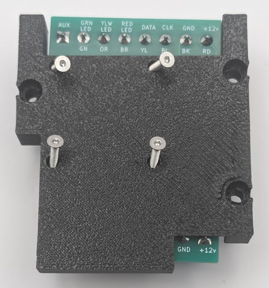
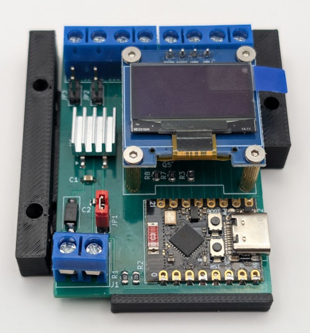
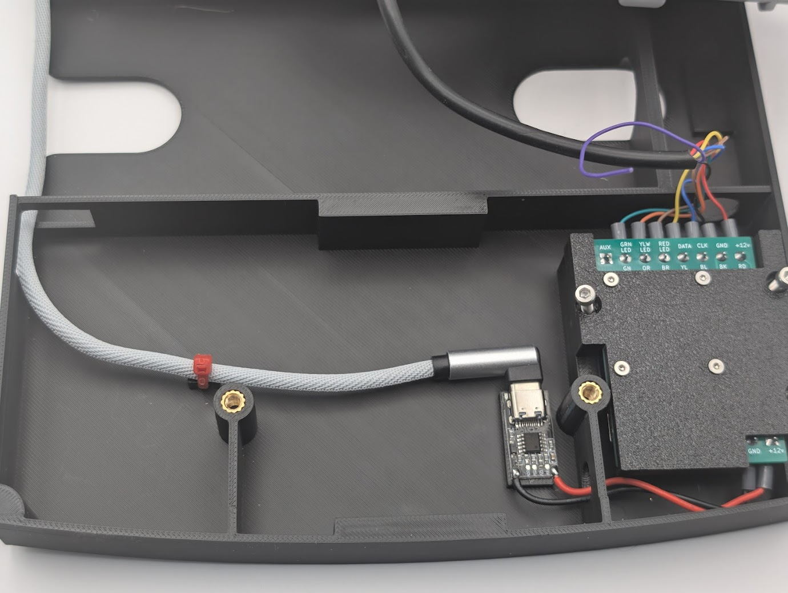
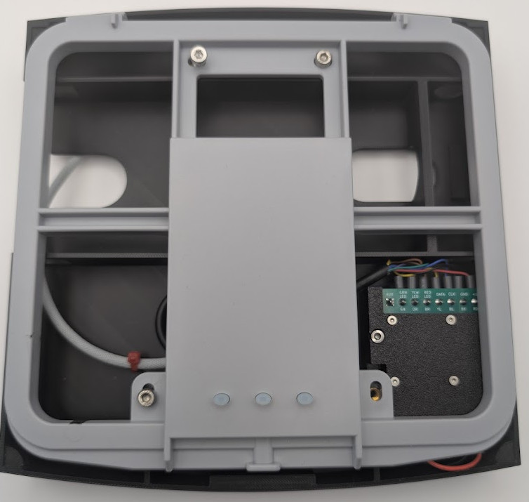

# Paxtogeddon-OLED-Case
### STL files for the Paxtogeddon reader with OLED case to fit Anker 525/325 power bank

The original case design was by 00Waz and this version was edited by en4rab to fit an Anker 325 or 525 power bank and pcb reader, any problems with it are en4rab's fault. 
To make a reader you need "Paxtogeddon-bracket.stl" and "Paxtogeddon-case-anker.stl" 

If you don’t have a P200 reader but want to make a demo device with a different model of reader there is "Paxtogeddon-case-coverplate.stl" which will adapt a P75 or P50 reader to fit on the case.

To use the smaller Anker 313 powerbank print "Paxtogeddon-case-infill.stl" and slide this into the hole for the powerbank to resize it.

This is a list of the misc hardware used to mount the pcb and reader into case. The URL's are not necessarily the best place to get the parts you may be able to get stuff cheaper but these are the listings used to get parts from:

| Qty  | Desc                                                       | Source                                                       | Price         |
| ---- | ---------------------------------------------------------- | ------------------------------------------------------------ | ------------- |
| 4    | M2 x 6 CSK to mount the OLED                               | https://www.aliexpress.com/item/32804364820.html             | £1.24 per 50  |
| 4    | M2 x 10 CSK to mount the pcb to the carrier                | https://www.aliexpress.com/item/32804364820.html             | £2.01 per 50  |
| 4    | M2 x 11mm brass standoffs                                  | https://www.aliexpress.com/item/1005006412726013.html        | £2.84 per 100 |
| 4    | M4 x 8 x 6OD Heat-Set Threaded Inserts                     | https://www.aliexpress.com/item/1005006798286851.html        | £5.31 per 100 |
| 3    | M3 x 5 x 5OD Heat-Set Threaded Inserts                     | https://www.aliexpress.com/item/1005006798286851.html        | £2.74 per 100 |
| 4    | M4 x 10 Cap head                                           | https://www.aliexpress.com/item/33008696963.html             | £5.89 per 100 |
| 3    | M3 x 10 Cap head                                           | https://www.aliexpress.com/item/33008696963.html             | £3.34 per 100 |
| 1    | TECHGEAR USB Type C Cable 30cm short 90 Degree Right Angle | https://www.amazon.co.uk/TECHGEAR-Reversible-Compatible-Samsung-OnePlus/dp/B07SSSGLJV | £3.95         |
| 1    | USB-C to 12v power supply module                           | https://www.aliexpress.com/item/1005004381460387.html        | £7.29 per 10  |
| 1    | Anker 525 Power Bank (PowerCore 20K)                       | https://www.anker.com/uk/products/a1287                      | £30           |

> [!WARNING]  
> Since designing this Anker appear to have discontinued the 525 power bank (A1287).
> An alternative may be to use a USB 5v to 12v boost converter module instead of the power delivery module and a non power delivery Anker powerbank like the 325 Power Bank (A1268) which is the same size.
> The slightly smaller 313 (A1229) might also work with a 3d printed insert to make the battery slot smaller. 
> The following boost converter has been ordered for testing and an initial quick test seemed to work.

| Qty  | Desc                                                       | Source                                                       | Price         |
| ---- | ---------------------------------------------------------- | ------------------------------------------------------------ | ------------- |
| 1    | USB-C to 12v boost converter                               | https://www.aliexpress.com/item/4000926897096.html      | £1.47         |
| 1    | Anker 325 Power Bank (PowerCore 20K)                       | https://www.anker.com/uk/products/a1268                      | £30           |

#### Assembly instructions

Build and program a Paxtogeddon reader PCB.  
Print the bracket and the case.  
Using a soldering iron insert the heatset inserts for the reader mounting (M4) and the PCB bracket (M3)  
Using 4 M2 x 10 CSK screws screw the PCB into the bracket.  

Cut the P200 reader cable to length and wire it to the paxtogeddon PCB. Its probably not best practice but I terminated the P200 wires by stripping the wire folding the end back over the insulation then crimping a bootlace ferrule to the end of the wire.

Solder wires to the USB-C to 12v power supply module, trim the wires to length, test it works and then superglue the board to the raised plinth next to where the paxtogeddon PCB is mounted.
Connect the wires from the 12v module paying attention to polarity.
Mount the bracket into the case using 3x M3x10 Cap head screws.

Insert the USB C cable into the 12v module and cable tie it securely to the cable tie loop, then pass the USB-A end through the slot in the case.
Screw the P200 reader to the case using 4x  M4x10 Cap head screws.

Fit the P200 cover and its retaining screw then slide the Anker power bank into the side of the case.

To use the reader insert the USB-A connector into the power bank and it should power up automatically.

