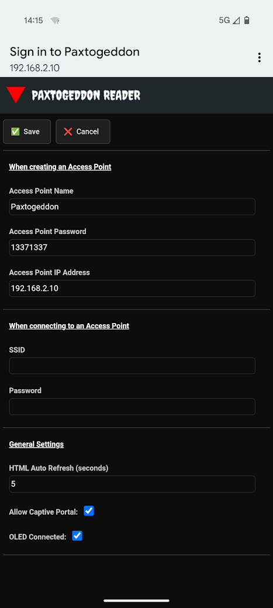
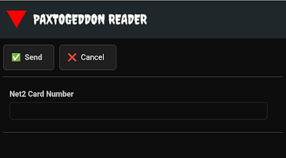

## Firmware

This directory contains Daniels Paxtogeddon reader firmware.

PaxtogeddonReaderV2 is the current firmware and has the following features:

#### Function cards

You can now use a selection of function cards to do some nice stuff like:

* Display "TEST CARD" for use in the field as initial test to ensure everything is working before you head out
  * Card number - 99999999
* Revert to defaults if you forget your password for the wifi, but it wont clear the log!
  * Card number - 99999998
* Connects to configured AP instead of acting as AP
  * Card number - 99999997
* Display AP info on connected OLED screen in case you forget it
  * Card number - 99999996

For more info on creating these cards see [MAKE-CARDS.md](MAKE-CARDS.md)

#### Settings menu

With this version you can also configure it from the web GUI without the need to reflash it every time you want to change the SSID, change the IP, or change the refresh timer.
It also has a captive portal for when you connect to the SSID on a phone it loads automatically for quickly accessing the web GUI.

#### Send card number

Unlike V1, the transmission pins are the same as the capture pins for retransmission of data if connected inline with a reader.
You can also send a specific number direct from the web GUI if you just want to type one in. This will calculate the CLK/Data and send over the transmission pins.

#### Companion App

There's a companion app to run on a windows host to make cloning cards easier, as it will send the commands directly from the web gui straight to your proxmark via the proxspace container app set up on Windows ([Proxspace Github](https://github.com/Gator96100/ProxSpace))